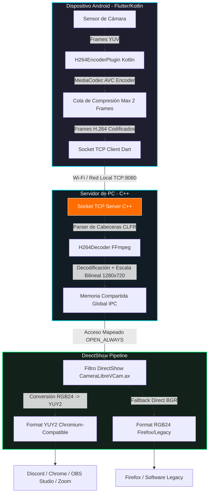

# 📸 Cámara Libre — OpenCamera

**Alternativa open-source de alto rendimiento a DroidCam, completamente gratuita y sin anuncios, que convierte tu smartphone Android en una webcam HD virtual de latencia ultra-baja en tu PC con Windows 10/11.**

---

## 📽️ Demostración Visual

Aquí puedes ver el sistema operando a pantalla completa en el teléfono Android (con atenuación inteligente de batería activa), transmitiendo en tiempo real mediante red local al servidor PC, decodificando y alimentando de forma transparente la cámara virtual en **OBS Studio** y **Discord** con colores naturales corregidos.

  
  
  
<i>Interfaz móvil Cyberpunk de alto contraste y panel de configuración de streaming DirectShow YUY2.</i>

*(Para agregar tu propio video o GIF de demostración en vivo, reemplaza estas imágenes en la carpeta del repositorio).*

---

## 💡 ¿Qué es Cámara Libre y por qué existe?

Muchas aplicaciones que convierten el teléfono en webcam están plagadas de publicidad molesta, marcas de agua intrusivas, límites de tiempo o suscripciones de pago mensuales.

**Cámara Libre** nace como una solución técnica y de código abierto sólida que Prioriza el Rendimiento. Combina un cliente ligero en **Flutter (Dart + Android Kotlin nativo)** con un servidor y un filtro de sistema **DirectShow (C++)** de Windows. A través de la codificación y decodificación directa por hardware, logramos un stream fluido y estable de **1280x720 a 30 FPS** con una latencia de apenas unos pocos milisegundos, convirtiendo tu smartphone en un periférico nativo del sistema operativo.

---

## 🎨 Características Clave (Features)

*   ⚡ **Latencia Ultra-Baja**: Codificación de hardware por MediaCodec H.264 (AVC) en Android y decodificación por hardware/software asíncrona FFmpeg en la PC.
*   📶 **Conexión Local Directa**: Comunicación directa vía Sockets TCP sin pasar por servidores de terceros.
*   🎥 **Cámara Virtual DirectShow Nativa (`.ax`)**: Registrada en el sistema COM para ser compatible con cualquier software moderno como **Discord Desktop, OBS Studio, Google Chrome, Microsoft Edge, Firefox, Zoom y Teams**.
*   🌈 **Colores Corregidos de Alta Fidelidad**: Conversión de color BGR24 a YUY2 optimizada a nivel binario que elimina los tonos azulados y restituye los colores cálidos naturales (tonos de piel, ropa naranja/roja).
*   🔋 **Auto-Dim Inteligente**: Si la app móvil no detecta actividad táctil por 5 segundos en streaming, disminuye la opacidad de la pantalla al 30% para reducir el renderizado gráfico de la GPU, previniendo el sobrecalentamiento y ahorrando batería.
*   🌐 **IP local y detección automática**: Monitor de IP local en la app para facilitar la sincronización.
*   💼 **IPC Robusto de Memoria Compartida**: Sincronización basada en memoria mapeada en disco con protección de lectura compartida. Si la aplicación móvil se desconecta, el filtro de la cámara virtual permanece activo en Discord/OBS mostrando un búfer seguro sin congelar o bloquear el software cliente.

---

## 🏗️ Arquitectura General

El siguiente flujo ilustra el ciclo de vida de un frame de video, desde que el sensor de la cámara en el teléfono captura la luz hasta que se renderiza en aplicaciones cliente de Windows (Discord/OBS):

---

## 📈 Roadmap y Estado del Proyecto

- [x] **Fase 1: Transmisión de Red Básica** — Sockets TCP raw + empaquetador de tramas estructurado (Framing).
- [x] **Fase 2: Stream JPEG + Preview** — Transmisión por cuadros JPEG y visor nativo de preview GDI+ en Windows.
- [x] **Fase 3: Transmisión H.264 de Alto Rendimiento** — Codificador de hardware Android (`MediaCodec`) y decodificador `libavcodec` de FFmpeg en PC.
- [x] **Fase 4: Filtro de Cámara Virtual Nativo** — Desarrollo del filtro COM DirectShow `.ax` con soporte de formato indexado (YUY2 prioritario + RGB24).
- [x] **Fase 5: UI Móvil Premium y GPU Layering** — Nueva interfaz Cyberpunk de alto contraste, protección contra notches de pantalla, auto-dim para batería, cola H.264 reducida a 2 frames y corrección de color YUV a RGB.
- [ ] **Fase 6: Próximos Pasos (En Desarrollo)** — Cliente de configuración visual nativo para Windows (GUI), soporte de bitrate dinámico según la calidad de la señal Wi-Fi, y empaquetador final con instalador `.msi`.

---

## 📦 Estructura de Carpetas

*   [`/mobile_app`](file:///d:/Programacion/OpenCamera/mobile_app): Aplicación móvil en Flutter. Contiene el pipeline de captura en Dart y el encoder de hardware nativo en Kotlin.
*   [`/pc_server`](file:///d:/Programacion/OpenCamera/pc_server): Servidor receptor TCP de consola en C++17 que decodifica el stream H.264 con FFmpeg y alimenta la memoria compartida.
*   [`/vcam_filter`](file:///d:/Programacion/OpenCamera/vcam_filter): Código fuente de la cámara virtual DirectShow C++. Se compila como una DLL de Windows con extensión `.ax`.
*   [`/scratch`](file:///d:/Programacion/OpenCamera/scratch): Utilidades, scripts de reinstalación y herramientas auxiliares de testeo.

---

## 🤝 Contribuciones

¡Todas las contribuciones son bienvenidas! Si deseas proponer cambios, corregir bugs o implementar funciones nuevas, lee nuestra [Guía de Contribución](file:///d:/Programacion/OpenCamera/CONTRIBUTING.md).

---

## 📜 Licencia

Este proyecto se distribuye bajo la Licencia **MIT**. Eres libre de usar, modificar y distribuir este software. Consulta el archivo [LICENSE](file:///d:/Programacion/OpenCamera/LICENSE) para más detalles.
